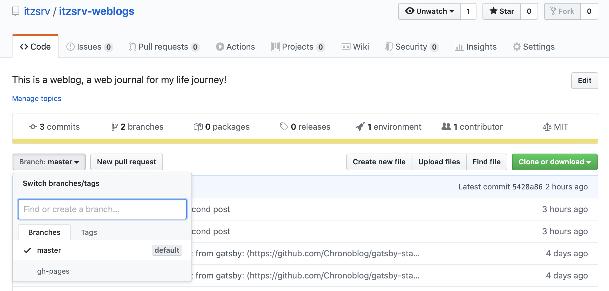
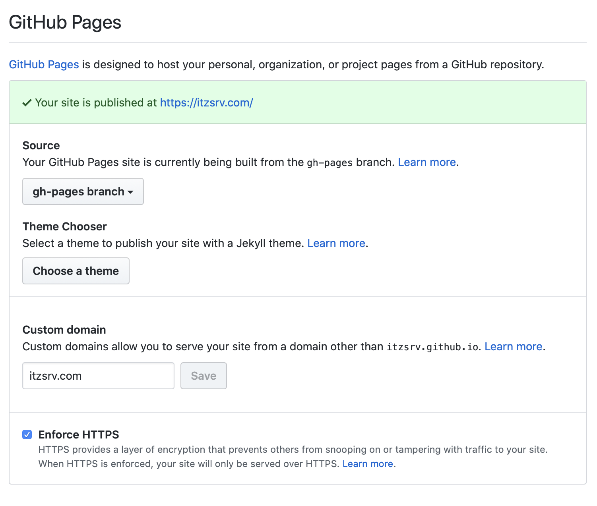

We can host our static sites freely using Github Hosting Service. Whether be it a simple HTML CSS page, or Modern JS Framework Pages with React, Angular or Veu, untill its a static website we can host it from Github Pages. 

As mentioned on Github about Github Pages :

>GitHub Pages is a static site hosting service that takes HTML, CSS, and JavaScript files straight from a repository on GitHub, optionally runs the files through a build process, and publishes a website.

I have created an npm React project, and I am setting gh-pages into my project. For that, I need to first install gh-pages and then configure the package.json file. But before going further, we need to register one domain and configure DNS settings for our Github Servers. If you don't have any registered domain, still you can host your site under GitHub subdomain.

I have registered my domain from GoDaddy, and to configure DNS for Github servers, below configurations need to be added in DNS.


In modern JS Frameworks, when the build command is run, the static website with all html, css and js are created under new directory, often called **build**, **dist**, or as in my case, **public**. These directories are usually marked in gitignore and are neither tracked nor commited to master branch of our repository. We will exclusively publish this directory to our repository with new branch named gh-pages with the help of below configurations. And then in the Github settings for our repository, we will host this gh-pages branch with Github Pages.

**Setting Github Pages for our Project**

We can install gh-pages into our project using below npm command
```js
npm install gh-pages
```

**Configuring values for homepage and scripts: deploy in my package.json**

We have to add the url of our github repo in **`homepage`**, as shown below in our package.json file.


And also, we have to add a **script** to deploy our build directory **`public`** to our gh-pages branch as shown below,


If your build directory is some other directory, you can give your directory name in place of public here. 

Now lets publish our build directory to our repository's gh-pages branch

```js
npm run deploy
```
Now you can check your branches in your Github repo and you will see a gh-pages branch will your build directory contents.



Select the branch gh-pages, then open Settings from top right corner and navigate to Github Pages as shown below



Provide the registered custom domain where you want to host your website, and you are good to go!  

One advantage of hosting on Github Pages over other hosting platforms is that Github provides free SSL-Certificate for its hosted site.


